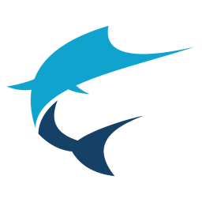

# Swordfish



An advanced CAT (Computer Aided Translation) tool based on XLIFF Standard that supports MS Office, DITA, HTML and other document formats.

Swordfish uses TM (Translation Memory) and MT (Machine Translation). Supports segment filtering, terminology, customization and more.

## Swordfish Videos

- [Build Swordfish from Source Code](https://youtu.be/xiHFxfqCleQ)
- [Translate a Segment Using the AI Prompt Dialog](https://youtu.be/8S420n2QieM)
- [Translate a Segment Using the AI Menu or Keyboard Shortcuts](https://youtu.be/FwsFZCjUajU)

## Licenses

Swordfish is available in two modes:

- Source Code
- Yearly Subscriptions for installers and support

### Source Code

Source code of Swordfish is free. Anyone can download the source code, compile, modify and use it at no cost in compliance with the accompanying license terms.

You can subscribe to [Maxprograms Support](https://groups.io/g/maxprograms/) at Groups.io and request peer assistance for the source code version there.

### Subscriptions

The version of Swordfish included in the official installers from [Maxprograms Download Page](https://www.maxprograms.com/downloads/index.html) can be used at no cost for 30 days requesting a free Evaluation Key.

Personal Subscription Keys are available in  [Maxprograms Online Store](https://www.maxprograms.com/store/buy.html).

Subscription Keys cannot be shared or transferred to different machines.

Installers may occasionally be updated before the corresponding source code changes appear in this repository. Source code updates are published later, once they are ready for release. This timing difference is expected and does not affect the availability or completeness of the open source code.

Subscription version includes unlimited email support at [tech@maxprograms.com](mailto:tech@maxprograms.com)

### Differences sumary

Differences | Source Code | Subscription Based
----------- | :---------: | :-----------------:
Ready To Use Installers | No | Yes
Notarized macOS launcher | No | Yes
Signed launcher and installer for Windows | No | Yes
Restricted Features | None | None
Technical Support | Peer support at [Groups.io](https://groups.io/g/maxprograms/) | - Direct email at [tech@maxprograms.com](mailto:tech@maxprograms.com)  <br> - Peer support at [Groups.io](https://groups.io/g/maxprograms/)

## Related Projects

- [RemoteTM](https://github.com/rmraya/RemoteTM)
- [OpenXLIFF Filters](https://github.com/rmraya/OpenXLIFF)

## Requirements

- JDK 21 or newer is required for compiling and building. Get it from [Adoptium](https://adoptium.net/).
- Gradle 9.2.1 or newer. Get it from [https://gradle.org](https://gradle.org)
- Node.js 24.11.1 LTS or newer. Get it from [https://nodejs.org/](https://nodejs.org/)

## Building

- Checkout this repository.
- Point your `JAVA_HOME` environment variable to JDK 21
- Run `gradle` to compile the Java code
- Run `npm install` to download and install NodeJS dependencies
- Run `npm start` to launch Swordfish

### Steps for building

``` bash
  git clone https://github.com/rmraya/Swordfish.git
  cd Swordfish
  gradle
  npm install
  npm start
```

Compile once and then simply run `npm start` to start Swordfish.
